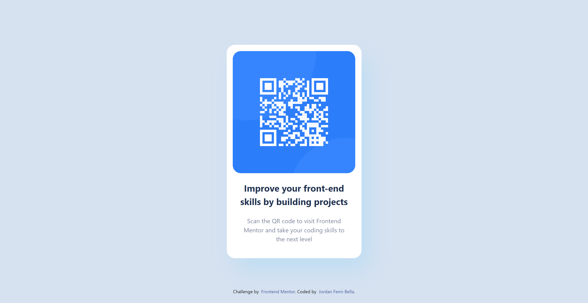

# Frontend Mentor - QR code component solution

This is a solution to the [QR code component challenge on Frontend Mentor](https://www.frontendmentor.io/challenges/qr-code-component-iux_sIO_H). Frontend Mentor challenges help you improve your coding skills by building realistic projects. 

## Table of contents

- [Overview](#overview)
  - [Screenshot](#screenshot)
  - [Links](#links)
- [My process](#my-process)
  - [Built with](#built-with)
  - [What I learned](#what-i-learned)
  - [Continued development](#continued-development)
  - [Useful resources](#useful-resources)
- [Author](#author)
- [Acknowledgments](#acknowledgments)

**Note: Delete this note and update the table of contents based on what sections you keep.**

## Overview

### Screenshot

### Links

- Live Site URL: [Add live site URL here](https://qrcodechallenge.web.app/)

### Built with

- [TailwindCss](https://tailwindcss.com/) - For styles
- [React](https://reactjs.org/) - JS library

### What I learned
How to center a DIV properly with tailwind css

### Useful resources

- [Tailwind docs](https://tailwindcss.com/docs) - This helped with some tailwind styles

## Author

- Frontend Mentor - [@jaythecree8tor](https://www.frontendmentor.io/profile/jaythecree8tor)
- Twitter - [@jaythecr8or](https://www.twitter.com/jaythecr8or)
